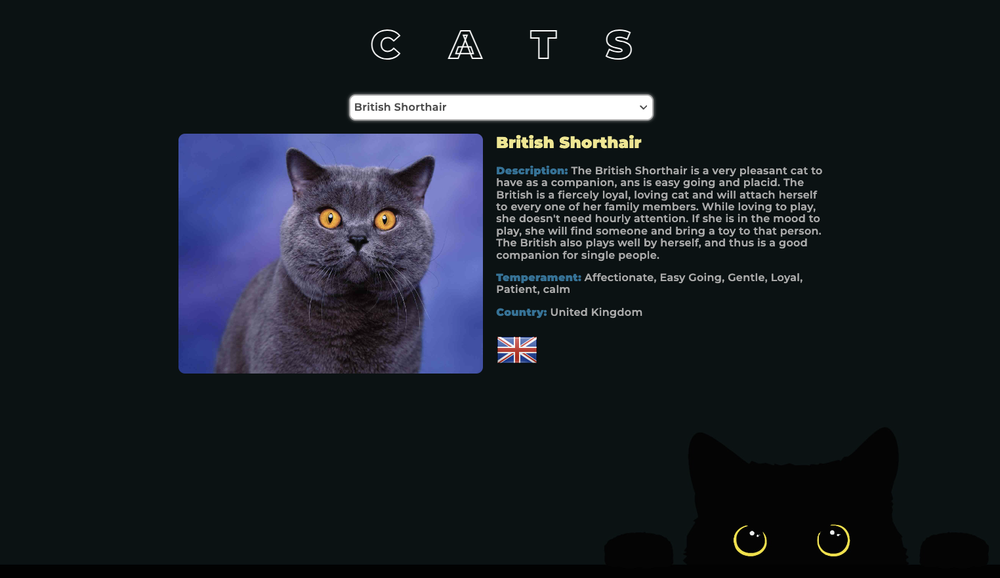

# Критерії приймання

- Створено репозиторій `goit-advancedjs-hw-03`.
- Домашня робота містить два посилання: на вихідні файли і робочу сторінку на
  `GitHub Pages`.
- В консолі відсутні помилки і попередження під час відкриття живої сторінки
  завдання.
- До роботи прiкрiплено файл репозиторiю у форматi `zip`.
- Проект зібраний за допомогою
  [vanilla-app-template](https://github.com/goitacademy/vanilla-app-template).
- Код відформатований за допомогою `Prettier`.

#### Формат оцінювання:

- Оцінка від 0 до 100

#### Формат здачi:

- Два посилання: на вихідні файли і робочу сторінку на `GitHub Pages`
  Прикрiплений файл репозиторію у форматi zip

## Стартові файли

[Завантажуй стартові файли](https://minhaskamal.github.io/DownGit/#/home?url=https:%2F%2Fgithub.com%2Fgoitacademy%2Fjavascript-homework%2Ftree%2Fmain%2Fv2%2F10%2Fsrc)
з базовою розміткою та стилями завдання. Скопіюй їх собі в проєкт, повністю
замінивши папку src у
[vanilla-app-template](https://github.com/goitacademy/vanilla-app-template).

## Завдання - Котопошук

Створи фронтенд частину застосунку для пошуку інформації про кота за його
породою. Подивися демо відео роботи програми, використовуй його як орієнтир для
необхідного функціоналу.

https://textbook.edu.goit.global/lms-js-homework/v2/uk/assets/medias/catsearch-demo-7a9eca87a69c1131c828592a49f6f647.mp4

## HTTP-запити

Використовуй публічний The Cat API. Для початку роботи необхідно зареєструватися
й отримати унікальний ключ доступу, щоб прикріплювати його до кожного запиту.
Заходимо на головну сторінку та натискаємо нижче кнопку Signup for free,
дотримуємося інструкції, ключ буде надіслано на вказану пошту.

Для використання ключа необхідно використовувати HTTP-заголовок x-api-key.
Рекомендується використовувати axios та додати заголовок до всіх запитів.

import axios from "axios";

axios.defaults.headers.common["x-api-key"] = "твій ключ";

## Колекція порід

Під час завантаження сторінки має виконуватися HTTP-запит за колекцією порід.
Для цього необхідно виконати GET-запит на ресурс
https://api.thecatapi.com/v1/breeds, що повертає масив об'єктів. У разі
успішного запиту, необхідно наповнити select.breed-select опціями так, щоб value
опції містило id породи, а в інтерфейсі користувачеві відображалася назва
породи.

Напиши функцію fetchBreeds(), яка виконує HTTP-запит і повертає проміс із
масивом порід - результатом запиту. Винеси її у файл cat-api.js та зроби
іменований експорт.

## Інформація про кота

Коли користувач обирає якусь опцію в селекті, необхідно виконувати запит за
повною інформацією про кота на ресурс
https://api.thecatapi.com/v1/images/search. Не забудь вказати в цьому запиті
параметр рядка запиту breed_ids з ідентифікатором породи.

Ось як буде виглядати URL-запит для отримання повної інформації про собаку за
ідентифікатором породи:

https://api.thecatapi.com/v1/images/search?breed_ids=ідентифікатор_породи

Напиши функцію fetchCatByBreed(breedId), яка очікує ідентифікатор породи, робить
HTTP-запит і повертає проміс із даними про кота - результатом запиту. Винеси її
у файл cat-api.js і зроби іменований експорт.

Якщо запит був успішний, під селектом у блоці div.cat-info з'являється
зображення і розгорнута інформація про кота: назва породи, опис і темперамент.

## Опрацювання стану завантаження

Поки відбувається будь-який HTTP-запит, необхідно показувати завантажувач -
елемент p.loader. Поки запитів немає або коли запит завершився, завантажувач
необхідно приховувати. Використовуй для цього додаткові CSS класи.

- Поки виконується запит за списком порід, необхідно приховати
  select.breed-select та показати p.loader.
- Поки виконується запит за інформацією про кота, необхідно приховати
  div.cat-info та показати p.loader.
- Як тільки будь-який запит завершився, p.loader треба приховати.

## Опрацювання помилки

Якщо у користувача сталася помилка під час будь-якого HTTP-запиту, наприклад,
впала мережа, була втрата пакетів тощо, тобто проміс було відхилено, необхідно
відобразити елемент p.error, а при кожному наступному запиті приховувати його.
Використовуй для цього додаткові CSS класи.

Протестувати працездатність відображення помилки дуже просто - зміни адресу
запиту додавши в кінець будь-який символ, наприклад замість
https://api.thecatapi.com/v1/breeds використай
https://api.thecatapi.com/v1/breeds123. Запит отримання списку порід буде
відхилено з помилкою. Аналогічно для запиту інформації про кота за породою.

## Інтерфейс

- Додай мінімальне оформлення елементів інтерфейсу.
- Замість select.breed-select можеш використовувати будь-яку бібліотеку з
  красивими селектом, наприклад https://slimselectjs.com/
- Замість p.loader можеш використовувати будь-яку бібліотеку з красивими
  CSS-завантажувачами, наприклад https://cssloaders.github.io/
- Замість завантажувача p.error можеш використовувати будь-яку бібліотеку з
  гарними сповіщеннями, наприклад iziToast

